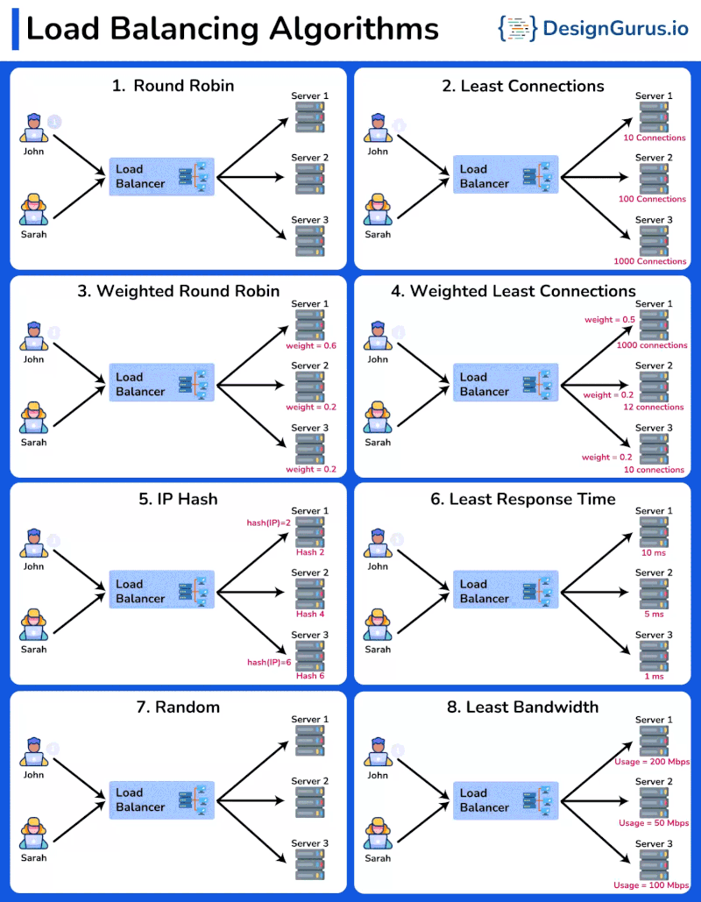

# Algoritmos de Load Balancing

1. Round Robin

Distribui solicitações sequencialmente em uma lista de servidores, como se revezassem.

2. Least Connections

Direciona solicitações para o servidor com menos conexões ativas.

3. Weighted Round Robin

Semelhante ao Round Robin, mas atribui pesos aos servidores com base em sua capacidade, direcionando mais tráfego para servidores mais poderosos.

4. Weighted Least Connections

Combina os benefícios de Least Connections e Weighted Round Robin, considerando a carga e a capacidade do servidor.

5. IP Hash

Usa o endereço IP do cliente para direcionar consistentemente suas solicitações para o mesmo servidor.

6. Least Response Time

Direciona solicitações para o servidor com o tempo de resposta mais rápido e o menor número de conexões ativas.

7. Random

Atribui solicitações aos servidores aleatoriamente.

8. Least Bandwidth

Envia solicitações ao servidor que consome a menor quantidade de largura de banda da rede.

# Referência
https://www.linkedin.com/feed/update/urn:li:activity:7218616253198794752/